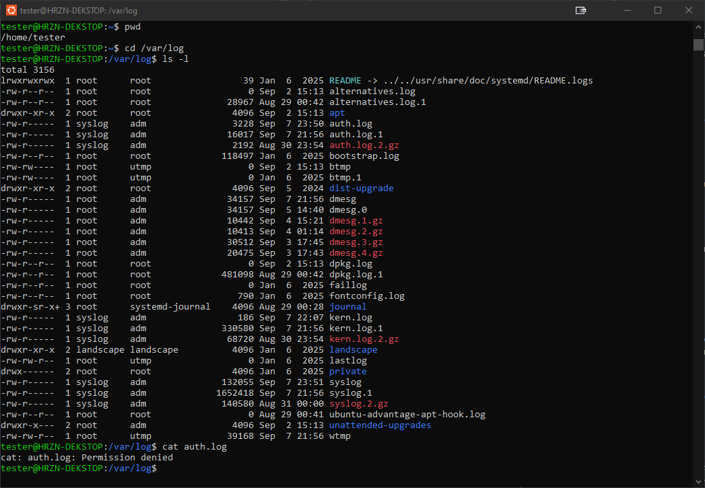

## **Objective:**  
Navigate to /var/log. list files with permissions, explain what you see.

## **Solution:**  
 I see files created by applications on the system, mostly log files that are owned by the root user and other users/non-sudoers cannot read or write nor execute these files (there are no executables tho)

